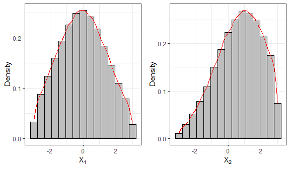
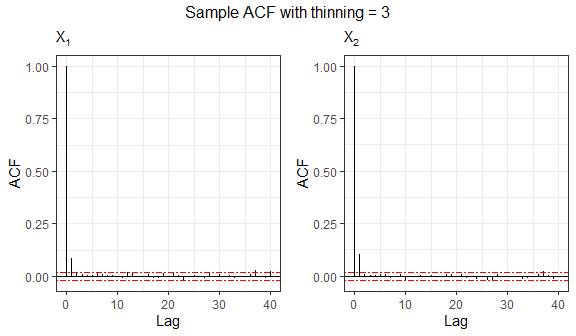

<!-- README.md is generated from README.Rmd. Please edit that file -->

## The `relliptical R` package

The `relliptical R` package offers random numbers generation from
members of the truncated multivariate elliptical family of distribution
such as the truncated versions of the Normal, Student-t, Laplace,
Pearson VII, Slash, Logistic, Kotz-type, among others. Particular
distributions can be provided by specifying the density generating
function. It also computes the first two moments (covariance matrix as
well) for some particular distributions. For more details see
(Valeriano, Galarza, and Matos 2023).

Next, we will show the functions available in the package.

## Sampling random numbers

The function `rtelliptical` generates observations from a truncated
multivariate elliptical distribution with location parameter `mu`, scale
matrix `Sigma`, lower and upper truncation points `lower` and `upper`
via Slice Sampling algorithm (Neal 2003) with Gibbs sampler (Robert and
Casella 2010) steps. The `dist` argument represents the truncated
distribution to be used. The values are `Normal`, `t`, `Laplace`, `PE`,
`PVII`, `Slash`, and `CN`, for the truncated Normal, Student-t, Laplace,
Power Exponential, Pearson VII, Slash, and Contaminated Normal
distributions, respectively.

In the following example, we generate $n = 10^5$ samples from the
truncated bivariate Normal distribution.

``` r
library(relliptical)

# Sampling from the Truncated Normal distribution
set.seed(1234)
mu  = c(0, 1)
Sigma = matrix(c(3,0.6,0.6,3), 2, 2)
lower = c(-3, -3)
upper = c(3, 3)
sample1 = rtelliptical(n=1e5, mu, Sigma, lower, upper, dist="Normal")
head(sample1)
#>            [,1]       [,2]
#> [1,]  0.6643105  2.4005763
#> [2,] -1.3364441 -0.1756624
#> [3,] -0.1814043  1.7013605
#> [4,] -0.6841829  2.4750461
#> [5,]  2.0984490  0.1375868
#> [6,] -1.8796633 -1.2629126

library(ggplot2)
# Histogram and density for variable 1
f1 = ggplot(data.frame(sample1), aes(x=X1)) + 
  geom_histogram(aes(y=after_stat(density)), colour="black", fill="grey", bins=15) +
  geom_density(colour="red") + labs(x=bquote(X[1]), y="Density") + theme_bw()

# Histogram and density for variable 2
f2 = ggplot(data.frame(sample1), aes(x=X2)) + 
  geom_histogram(aes(y=after_stat(density)), colour="black", fill="grey", bins=15) +
  geom_density(colour="red") + labs(x=bquote(X[2]), y="Density") + theme_bw()

library(gridExtra)
grid.arrange(f1, f2, nrow=1)
```



This function also allows generating random numbers from other truncated
elliptical distributions not specified in the `dist` argument, by
supplying the density generating function (DGF) through arguments either
`expr` or `gFun`. The DGF must be a non-negative and strictly decreasing
function on $(0, \infty)$. The easiest way is to provide the DGF
expression to argument `expr` as a character. The notation used in
`expr` needs to be understood by package `Ryacas0` and the environment
of `R`. For instance, for the DGF $g(t)=e^{-t}$, the user must provide
`expr = "exp(1)^(-t)"`. See that the function must depend only on
variable $t$, and any additional parameter must be passed as a fixed
value. For this case, when a character expression is provided to `expr`,
the algorithm tries to compute a closed-form expression for the inverse
function of $g(t)$, however, this is not always possible (a warning
message is returned).

The following example draws random variates from a truncated bivariate
Logistic distribution, whose DGF is given by
$g(t) = e^{-t}/(1+e^{-t})^2, t \geq 0$, see (Fang, Kotz, and Ng 2018).

``` r
# Sampling from the Truncated Logistic distribution
mu  = c(0, 0)
Sigma = matrix(c(1,0.70,0.70,1), 2, 2)
lower = c(-2, -2)
upper = c(3, 2)
# Sample autocorrelation with no thinning
set.seed(5678)
sample2 = rtelliptical(n=1e4, mu, Sigma, lower, upper, expr="exp(1)^(-t)/(1+exp(1)^(-t))^2")
tail(sample2)
#>                [,1]       [,2]
#>  [9995,] -0.5639346 -1.4225548
#>  [9996,] -0.4747796 -1.1890135
#>  [9997,] -0.2596561 -0.1126482
#>  [9998,] -1.1517285 -0.9875129
#>  [9999,] -0.9268744 -1.5526844
#> [10000,] -1.1763390 -1.3098489
```

If it was no possible to generate random samples by passing a character
expression to `expr`, the user may provide a custom `R` function to the
`gFun` argument. By default, its inverse function is approximated
numerically, however, the user may also provide its inverse to the
`ginvFun` argument to gain some computational time. When `gFun` is
provided, arguments `dist` and `expr` are ignored.

In the next example, we will draw samples from the truncated Kotz-type
distribution, whose DGF is given by

$$g(t) = t^{N-1} e^{-r t^s}, \quad t\geq 0, \quad r>0, \quad s>0, \quad 2N+p>2.$$

As required, this function is strictly decreasing when
$(2-p)/2 < N \leq 1$, see (Fang, Kotz, and Ng 2018).

``` r
# Sampling from the Truncated Kotz-type distribution
set.seed(9876)
mu  = c(0, 0)
Sigma = matrix(c(1,0.70,0.70,1), 2, 2)
lower = c(-2, -2)
upper = c(3, 2)
sample4 = rtelliptical(n=1e4, mu, Sigma, lower, upper, gFun=function(t){ t^(-1/2)*exp(-2*t^(1/4)) })
f1 = ggplot(data.frame(sample4), aes(x=X1, y=X2)) + geom_point(size=0.50) +
     labs(x=expression(X[1]), y=expression(X[2]), subtitle="Kotz(2,1/4,1/2)") + theme_bw()

library(ggExtra)
ggMarginal(f1, type="histogram", fill="grey")
```


Since the generating process uses an MCMC method, observations will be
correlated, so it may be of interest to study some ACF plots. Now, we
study the sample from the bivariate logistic distribution.

``` r
grid.arrange(grobs=acf.plot(sample2), top="Sample ACF with no thinning", nrow=1)
```


Autocorrelation can be decimated by setting the `thinning` argument. The
thinning factor reduces the autocorrelation of the random points in the
Gibbs sampling process. Thinning consists in picking separated points
from the sample, at each k-th step. As natural, this value must be an
integer greater than or equal to 1.

``` r
# Sample autocorrelation with thinning = 3
set.seed(8768)
sample3 = rtelliptical(n=1e4, mu, Sigma, lower, upper, dist=NULL, expr="exp(1)^(-t)/(1+exp(1)^(-t))^2", 
                       thinning=3)
grid.arrange(grobs=acf.plot(sample3), top="Sample ACF with thinning = 3", nrow=1)
```



## Mean and variance-covariance matrix

For this purpose, we call the function `mvtelliptical()`, which returns
the mean vector and variance-covariance matrix for some specific
truncated elliptical distributions. The argument `dist` sets the
distribution to be used and accepts the same values `Normal`, `t`,
`Laplace`, `PE`, `PVII`, `Slash`, and `CN` as before. Moments are
computed through Monte Carlo method for the truncated variables and
using properties of the conditional expectation for the non-truncated
variables.

Next, we compute the moments for a random variable $X$ following a
truncated 3-variate Student-t distribution with $\nu=0.8$ degrees of
freedom. We will consider two scenarios: a first one with only one
doubly truncated variable, and a second one with two doubly truncated
variables.

``` r
# Truncated Student-t distribution
set.seed(5678)
mu    = c(0.1, 0.2, 0.3)
Sigma = matrix(data = c(1,0.2,0.3,0.2,1,0.4,0.3,0.4,1), nrow=length(mu), ncol=length(mu), byrow=TRUE)

# Example 1: one doubly truncated student-t (nu = 0.80)
a = c(-0.8, -Inf, -Inf)
b = c(0.5, 0.6, Inf)
mvtelliptical(a, b, mu, Sigma, "t", 0.80)
#> $EY
#>             [,1]
#> [1,] -0.11001805
#> [2,] -0.54278399
#> [3,] -0.01119847
#> 
#> $EYY
#>            [,1]       [,2]       [,3]
#> [1,] 0.13761136 0.09694152 0.04317817
#> [2,] 0.09694152        NaN        NaN
#> [3,] 0.04317817        NaN        NaN
#> 
#> $VarY
#>            [,1]       [,2]       [,3]
#> [1,] 0.12550739 0.03722548 0.04194614
#> [2,] 0.03722548        NaN        NaN
#> [3,] 0.04194614        NaN        NaN

# Example 2: considering nu = 0.80 and two doubly truncated variables
a = c(-0.8, -0.70, -Inf)
b = c(0.5, 0.6, Inf)
mvtelliptical(a, b, mu, Sigma, "t", 0.80) # By default n=1e4
#> $EY
#>             [,1]
#> [1,] -0.08566441
#> [2,]  0.01563586
#> [3,]  0.19215627
#> 
#> $EYY
#>             [,1]        [,2]       [,3]
#> [1,] 0.126040187 0.005937196 0.01331868
#> [2,] 0.005937196 0.119761635 0.04700108
#> [3,] 0.013318682 0.047001083 1.14714388
#> 
#> $VarY
#>             [,1]        [,2]       [,3]
#> [1,] 0.118701796 0.007276632 0.02977964
#> [2,] 0.007276632 0.119517155 0.04399655
#> [3,] 0.029779636 0.043996554 1.11021985
```

As seen for the first scenario, some elements of the variance-covariance
matrix are shown as `NaN`. Those are the cases where the moment does not
exist (yes, some elements of the variance-covariance matrix may exist
and others may not). It is well know that for a Student-t distribution
its second moment exist if $\nu>2$, however, as studied by (Galarza et
al. 2022), this condition is relaxed as the number of dimensions
containing only finite truncation limits increases.

It is worth mention that the Student-$t$ distribution with $\nu > 0$
degrees of freedom is a particular case of the Pearson VII distribution
with parameters $m > p/2$ and $\nu^* > 0$ when $m = (\nu+p)/2$ and
$\nu^* = \nu$.

Finally, for comparison purposes, we compute the moments for a doubly
truncated Pearson VII distribution with parameters $\nu^* = \nu = 0.80$
and $m = (\nu + 3)/2 = 1.90$, which is equivalent to the Student-t
distribution mentioned above. Therefore, their moments should be nearly
equal.

``` r
# Truncated Pearson VII distribution
set.seed(9876)
a  = c(-0.8, -0.70, -Inf)
b  = c(0.5, 0.6, Inf)
mu = c(0.1, 0.2, 0.3)
Sigma = matrix(data = c(1,0.2,0.3,0.2,1,0.4,0.3,0.4,1), nrow=length(mu), ncol=length(mu), byrow=TRUE)
mvtelliptical(a, b, mu, Sigma, "PVII", c(1.90,0.80), n=1e6) # n=1e6 more precision
#> $EY
#>             [,1]
#> [1,] -0.08558130
#> [2,]  0.01420611
#> [3,]  0.19166895
#> 
#> $EYY
#>             [,1]        [,2]       [,3]
#> [1,] 0.128348258 0.006903655 0.01420704
#> [2,] 0.006903655 0.121364742 0.04749544
#> [3,] 0.014207043 0.047495444 1.15156461
#> 
#> $VarY
#>             [,1]        [,2]       [,3]
#> [1,] 0.121024099 0.008119433 0.03061032
#> [2,] 0.008119433 0.121162929 0.04477257
#> [3,] 0.030610322 0.044772574 1.11482763
```

### References

<div id="refs" class="references csl-bib-body hanging-indent">

<div id="ref-fang2018symmetric" class="csl-entry">

Fang, K. T., S. Kotz, and K. W. Ng. 2018. *Symmetric Multivariate and
Related Distributions*. Chapman; Hall/CRC.

</div>

<div id="ref-galarza2020moments" class="csl-entry">

Galarza, C. E., L. A. Matos, L. M. Castro, and V. H. Lachos. 2022.
“Moments of the Doubly Truncated Selection Elliptical Distributions with
Emphasis on the Unified Multivariate Skew-t Distribution.” *Journal of
Multivariate Analysis* 189: 104944.
<https://doi.org/10.1016/j.jmva.2021.104944>.

</div>

<div id="ref-neal2003slice" class="csl-entry">

Neal, R. M. 2003. “Slice Sampling.” *Annals of Statistics*, 705–41.

</div>

<div id="ref-robert2010introducing" class="csl-entry">

Robert, C. P., and G. Casella. 2010. *Introducing <span
class="nocase">Monte Carlo Methods with R</span>*. Vol. 18. New York:
Springer.

</div>

<div id="ref-valeriano2023moments" class="csl-entry">

Valeriano, Katherine A. L., Christian E. Galarza, and Larissa A. Matos.
2023. “Moments and Random Number Generation for the Truncated Elliptical
Family of Distributions.” *Statistics and Computing* 33 (1): 32.

</div>

</div>
